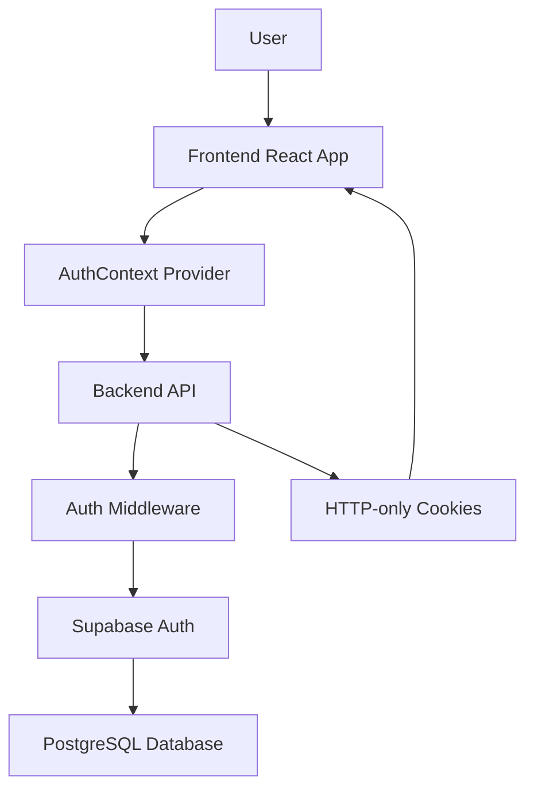
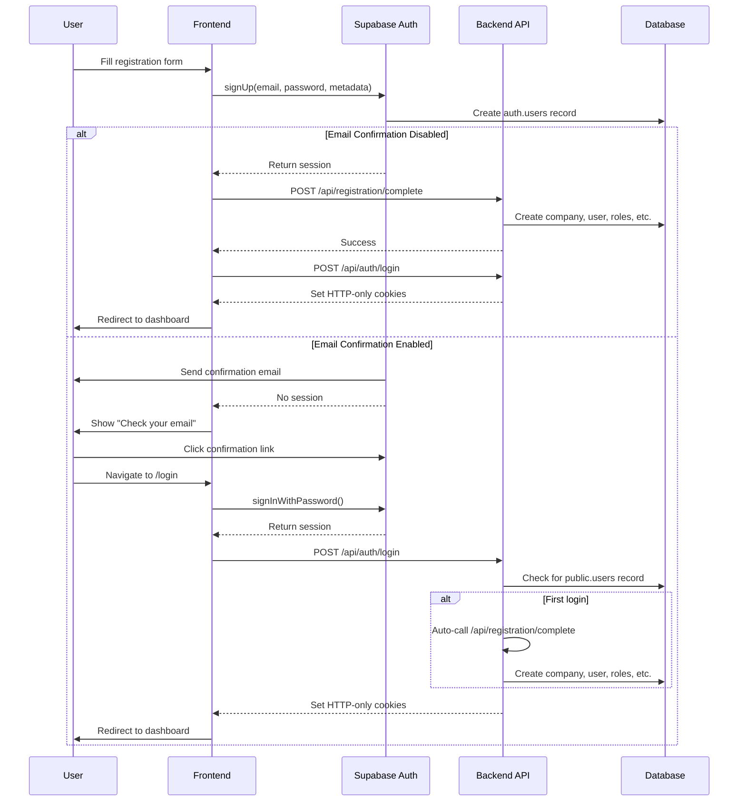
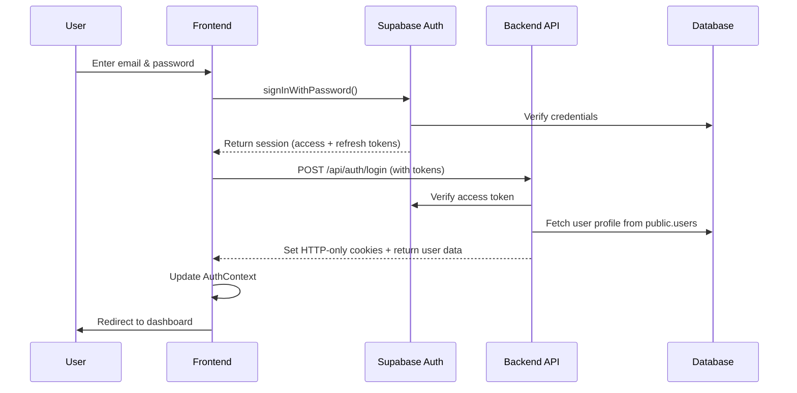
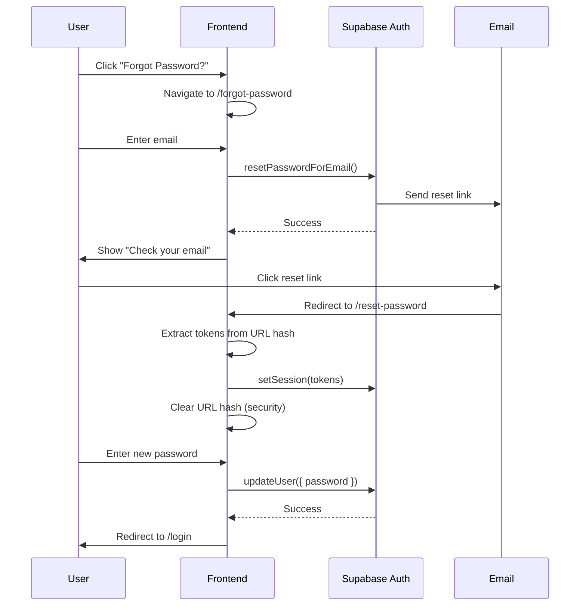
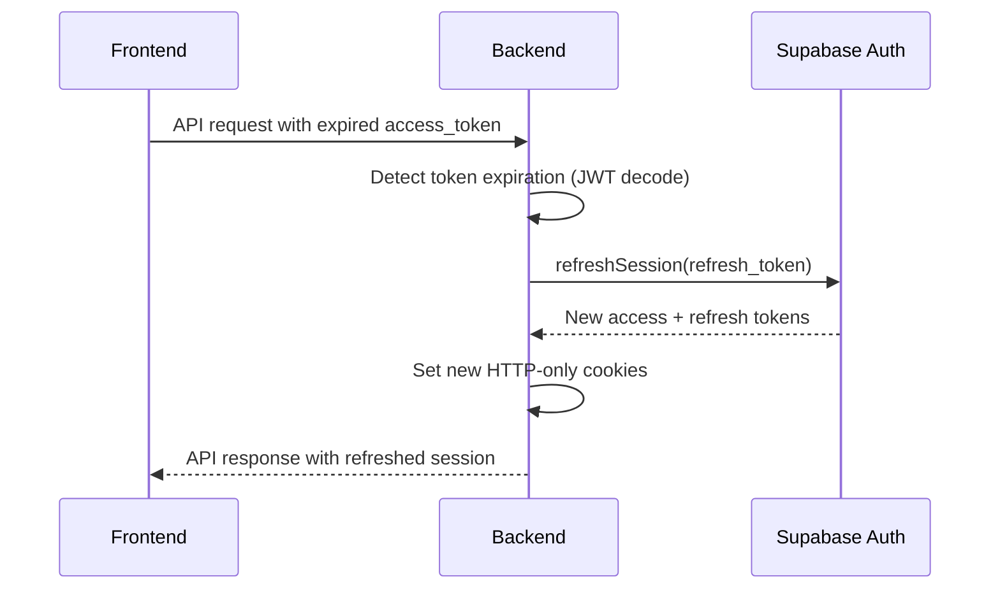
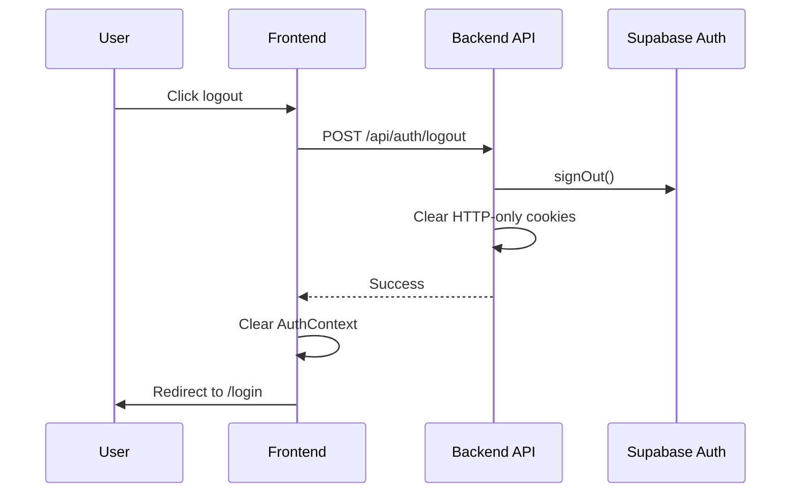

# Ribo CRM - Authentication System Documentation

## Table of Contents
1. [Overview](#overview)
2. [Architecture](#architecture)
3. [Authentication Flows](#authentication-flows)
4. [Components](#components)
5. [Security Features](#security-features)
6. [API Endpoints](#api-endpoints)
7. [Configuration](#configuration)
8. [Testing](#testing)
9. [Troubleshooting](#troubleshooting)

---

## Overview

Ribo CRM uses a **JWT-based authentication system** powered by Supabase Auth with HTTP-only cookies for web clients and Bearer tokens for mobile/API clients.

### Key Features
- ✅ Email/password authentication
- ✅ User registration with company provisioning
- ✅ Password reset via email
- ✅ Automatic token refresh
- ✅ HTTP-only cookie security
- ✅ Protected routes
- ✅ Multi-device support (web + mobile)

### Technology Stack
- **Frontend**: React + React Router
- **Backend**: Express.js + Supabase Auth
- **Database**: PostgreSQL (Supabase)
- **Token Type**: JWT (JSON Web Tokens)
- **Storage**: HTTP-only cookies (web), Bearer tokens (mobile)

---

## Architecture

### High-Level Flow



### Component Layers

```
┌─────────────────────────────────────────────┐
│           Frontend (React)                  │
│  ┌─────────────────────────────────────┐   │
│  │ Auth Pages (Login, Register, etc.)  │   │
│  └─────────────────────────────────────┘   │
│  ┌─────────────────────────────────────┐   │
│  │ AuthContext (State Management)      │   │
│  └─────────────────────────────────────┘   │
│  ┌─────────────────────────────────────┐   │
│  │ Protected/Public Route Wrappers     │   │
│  └─────────────────────────────────────┘   │
└─────────────────────────────────────────────┘
                    ↕ HTTP
┌─────────────────────────────────────────────┐
│           Backend (Express)                 │
│  ┌─────────────────────────────────────┐   │
│  │ Auth Routes (/api/auth/*)           │   │
│  └─────────────────────────────────────┘   │
│  ┌─────────────────────────────────────┐   │
│  │ Auth Middleware                      │   │
│  └─────────────────────────────────────┘   │
│  ┌─────────────────────────────────────┐   │
│  │ Supabase Client                      │   │
│  └─────────────────────────────────────┘   │
└─────────────────────────────────────────────┘
                    ↕
┌─────────────────────────────────────────────┐
│      Supabase (Auth + Database)             │
└─────────────────────────────────────────────┘
```

---

## Authentication Flows

### 1. Registration Flow



### 2. Login Flow



### 3. Password Reset Flow



### 4. Token Refresh Flow



### 5. Logout Flow



---

## Components

### Frontend Components

#### 1. AuthContext (`client/src/context/AuthContext.jsx`)

**Purpose**: Global authentication state management

**State:**
```javascript
{
  user: Object | null,     // Current user data
  loading: boolean,        // Initial auth check
  login: Function,         // Login method
  logout: Function,        // Logout method
  setUser: Function        // Update user state
}
```

**Methods:**
- `checkUser()` - Validates session on app load
- `login(email, password)` - Authenticates user
- `logout()` - Ends session and redirects

**Usage:**
```javascript
import { useAuth } from './context/AuthContext';

function MyComponent() {
  const { user, loading, logout } = useAuth();
  
  if (loading) return <div>Loading...</div>;
  if (!user) return <div>Not authenticated</div>;
  
  return <button onClick={logout}>Logout</button>;
}
```

#### 2. Route Wrappers (`client/src/App.jsx`)

**ProtectedRoute:**
```javascript
// Requires authentication
<ProtectedRoute>
  <Dashboard />
</ProtectedRoute>
```

**PublicRoute:**
```javascript
// Redirects to dashboard if already logged in
<PublicRoute>
  <Login />
</PublicRoute>
```

#### 3. Auth Pages

| Page | Path | Purpose |
|------|------|---------|
| `Login.jsx` | `/login` | Email/password login |
| `Register.jsx` | `/register` | New user registration |
| `ForgotPassword.jsx` | `/forgot-password` | Request password reset |
| `ResetPassword.jsx` | `/reset-password` | Set new password |

### Backend Components

#### 1. Auth Middleware (`server/middleware/auth.js`)

**Purpose**: Validates JWT tokens and refreshes expired sessions

**Features:**
- ✅ Bearer token support (mobile/API)
- ✅ Cookie-based auth (web)
- ✅ Automatic token refresh
- ✅ 60-second expiry buffer

**Flow:**
```javascript
1. Check for Bearer token (Authorization header)
   ↓ If found → Validate → Attach user to req
   
2. Check for access_token cookie
   ↓ If expired → Use refresh_token → Set new cookies
   
3. Validate access_token
   ↓ Attach user to req.user
   
4. Call next() or return 401
```

**Usage:**
```javascript
import { authMiddleware } from './middleware/auth.js';

router.get('/protected', authMiddleware, (req, res) => {
  res.json({ user: req.user });
});
```

#### 2. Auth Controller (`server/controllers/authController.js`)

**Functions:**

| Function | Purpose |
|----------|---------|
| `registerUser` | Creates Supabase auth user |
| `loginUser` | Validates credentials, sets cookies |
| `logout` | Clears session cookies |
| `getMe` | Returns current user data |
| `requestPasswordReset` | Sends reset email |
| `resetPassword` | Updates password |

#### 3. Registration Controller (`server/controllers/registrationController.js`)

**Purpose**: Provisions company and user data after Supabase auth

**Creates:**
- Company record
- User record (linked to auth.users)
- Admin role
- Role permissions (all 53 permissions)
- Subscription (trial plan)
- Default lead statuses (4)
- Default opportunity stages (6)

---

## Security Features

### 1. HTTP-Only Cookies

**Why?**
- Prevents XSS attacks (JavaScript cannot access cookies)
- Automatically sent with requests
- Secure flag in production (HTTPS only)

**Configuration:**
```javascript
{
  httpOnly: true,           // No JavaScript access
  secure: isProd,           // HTTPS only in production
  sameSite: isProd ? 'None' : 'Lax',  // CSRF protection
  path: '/',
  maxAge: 60 * 60 * 1000   // 1 hour (access token)
}
```

### 2. Token Refresh Strategy

- **Access Token**: 1 hour expiry
- **Refresh Token**: 14 days expiry
- **Auto-refresh**: 60 seconds before expiry
- **Refresh endpoint**: Automatic in middleware

### 3. Password Reset Security

- ✅ Short-lived tokens (1 hour)
- ✅ Single-use tokens
- ✅ URL hash clearing (prevents history exposure)
- ✅ Error capture prevention
- ✅ Type validation (`type=recovery`)

### 4. CORS Configuration

**Development:**
```javascript
origin: 'http://localhost:5173',
credentials: true
```

**Production:**
```javascript
origin: process.env.CLIENT_URL,
credentials: true,
secure: true
```

### 5. Environment Variables

**Required:**
```env
# Supabase
SUPABASE_URL=https://xxx.supabase.co
SUPABASE_ANON_KEY=xxx
SUPABASE_SERVICE_KEY=xxx

# Server
PORT=4000
NODE_ENV=production

# Client
CLIENT_URL=https://yourdomain.com
```

---

## API Endpoints

### Public Endpoints (No Auth Required)

| Method | Endpoint | Purpose | Request Body |
|--------|----------|---------|--------------|
| POST | `/api/auth/register` | Create new user | `{ email, password, name }` |
| POST | `/api/auth/login` | Authenticate user | `{ access_token, refresh_token }` |
| POST | `/api/auth/forgot-password` | Request reset email | `{ email }` |
| POST | `/api/auth/reset-password` | Update password | `{ access_token, new_password }` |
| POST | `/api/registration/complete` | Provision user data | `{ access_token, refresh_token, name, email }` |

### Protected Endpoints (Auth Required)

| Method | Endpoint | Purpose | Response |
|--------|----------|---------|----------|
| GET | `/api/auth/me` | Get current user | `{ user: {...} }` |
| POST | `/api/auth/logout` | End session | `{ message: 'Logged out' }` |

---

## Configuration

### Supabase Dashboard

**Authentication → Email Auth:**
```
☐ Enable email confirmations (Development)
☑ Enable email confirmations (Production)
☑ Secure email change
☑ Double confirm email changes
```

**Authentication → Email Templates:**
- Confirmation Email
- Reset Password Email
- Magic Link Email

**Security → Rate Limiting:**
```
Password reset requests: 5 per hour per IP
Login attempts: 10 per hour per IP
```

### Frontend Environment (`.env`)

```env
VITE_API_BASE_URL=http://localhost:4000/api
VITE_SUPABASE_URL=https://xxx.supabase.co
VITE_SUPABASE_ANON_KEY=xxx
```

### Backend Environment (`.env`)

```env
SUPABASE_URL=https://xxx.supabase.co
SUPABASE_ANON_KEY=xxx
SUPABASE_SERVICE_KEY=xxx
PORT=4000
NODE_ENV=development
CLIENT_URL=http://localhost:5173
```

---

## Testing

### Manual Testing Checklist

**Registration:**
- [ ] Register with email confirmation disabled
- [ ] Register with email confirmation enabled
- [ ] Verify company creation
- [ ] Verify default roles and permissions
- [ ] Verify default statuses

**Login:**
- [ ] Login with valid credentials
- [ ] Login with invalid credentials
- [ ] Login after email confirmation
- [ ] Verify cookies are set
- [ ] Verify user data returned

**Password Reset:**
- [ ] Request reset for valid email
- [ ] Request reset for invalid email (should still show success)
- [ ] Click reset link
- [ ] Verify URL hash is cleared
- [ ] Reset password successfully
- [ ] Try to reuse reset link (should fail)

**Token Refresh:**
- [ ] Wait for access token to expire
- [ ] Make API request
- [ ] Verify automatic refresh
- [ ] Verify new cookies set

**Logout:**
- [ ] Logout successfully
- [ ] Verify cookies cleared
- [ ] Verify redirect to login
- [ ] Try to access protected route (should redirect)

### SQL Verification Queries

```sql
-- Verify user registration
SELECT 
  u."userId",
  u.name,
  u.email,
  c.name as company_name,
  r.name as role_name,
  COUNT(rp."permissionId") as permission_count
FROM users u
JOIN companies c ON u."companyId" = c."companyId"
JOIN "userRoles" ur ON u."userId" = ur."userId"
JOIN roles r ON ur."roleId" = r."roleId"
LEFT JOIN "rolePermissions" rp ON r."roleId" = rp."roleId"
WHERE u.email = 'test@example.com'
GROUP BY u."userId", u.name, u.email, c.name, r.name;

-- Verify default statuses
SELECT * FROM "leadStatuses" WHERE "companyId" = 'xxx';
SELECT * FROM "opportunityStages" WHERE "companyId" = 'xxx';
```

---

## Troubleshooting

### Common Issues

**1. "No tokens provided" (401)**
- **Cause**: Cookies not being sent
- **Solution**: Check CORS credentials setting, ensure `withCredentials: true`

**2. "Session expired. Please login again." (401)**
- **Cause**: Refresh token expired (14 days)
- **Solution**: User must login again

**3. "Invalid or expired reset link"**
- **Cause**: Reset token expired or already used
- **Solution**: Request new password reset

**4. "Database error saving new user"**
- **Cause**: Foreign key constraint issues
- **Solution**: Ensure `users_authUserId_fkey` is DEFERRABLE

**5. Cookies not persisting**
- **Cause**: SameSite/Secure settings mismatch
- **Solution**: 
  - Development: `sameSite: 'Lax'`, `secure: false`
  - Production: `sameSite: 'None'`, `secure: true`

### Debug Logging

**Backend:**
```javascript
console.log('🌐 Auth: valid access; user:', user.id);
console.log('♻️ Auth: token auto-refreshed; user:', user.id);
console.log('📱 Auth: Bearer token valid; user:', user.id);
```

**Frontend:**
```javascript
console.log('✅ Valid session found for password reset');
console.log('✅ Found recovery token in URL hash');
```

---

## Best Practices

### Security
1. ✅ Always use HTTPS in production
2. ✅ Set `secure: true` for cookies in production
3. ✅ Never log sensitive tokens
4. ✅ Implement rate limiting
5. ✅ Use strong password requirements

### Performance
1. ✅ Implement token refresh to avoid re-login
2. ✅ Cache user data in AuthContext
3. ✅ Use HTTP-only cookies to reduce XSS risk

### User Experience
1. ✅ Show loading states during auth checks
2. ✅ Provide clear error messages
3. ✅ Auto-redirect after successful actions
4. ✅ Remember user preference (remember me)

---

## Related Documentation

- [Registration Guide](./Registration_Guide.md) - Detailed registration flow
- [Password Reset Security](../brain/password_reset_security.md) - Security enhancements
- [Database Schema](../../Knowledge base/Database Schema) - Database structure

---

## Support

For issues or questions:
1. Check this documentation
2. Review error logs (backend console)
3. Verify Supabase dashboard settings
4. Check environment variables

**Last Updated:** 2026-02-12
