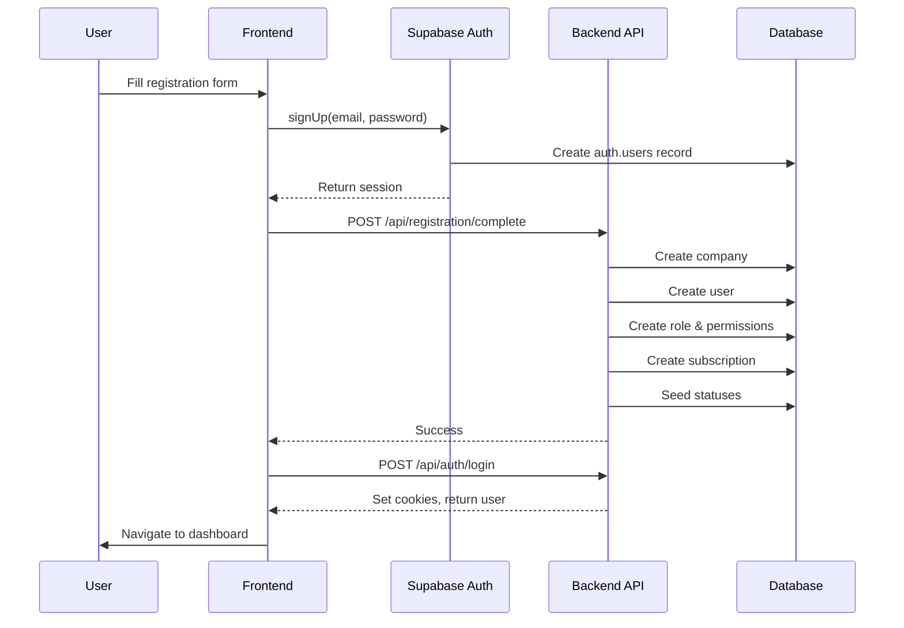
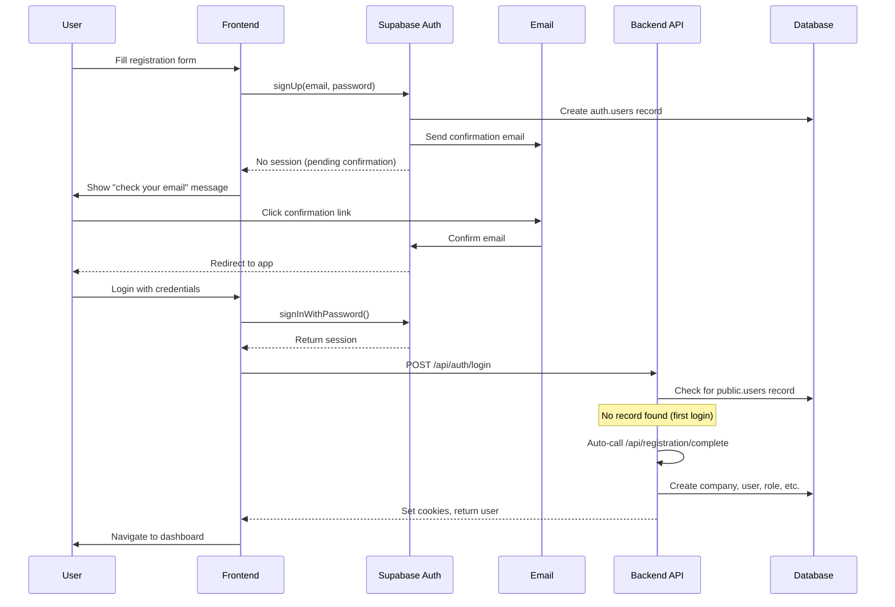
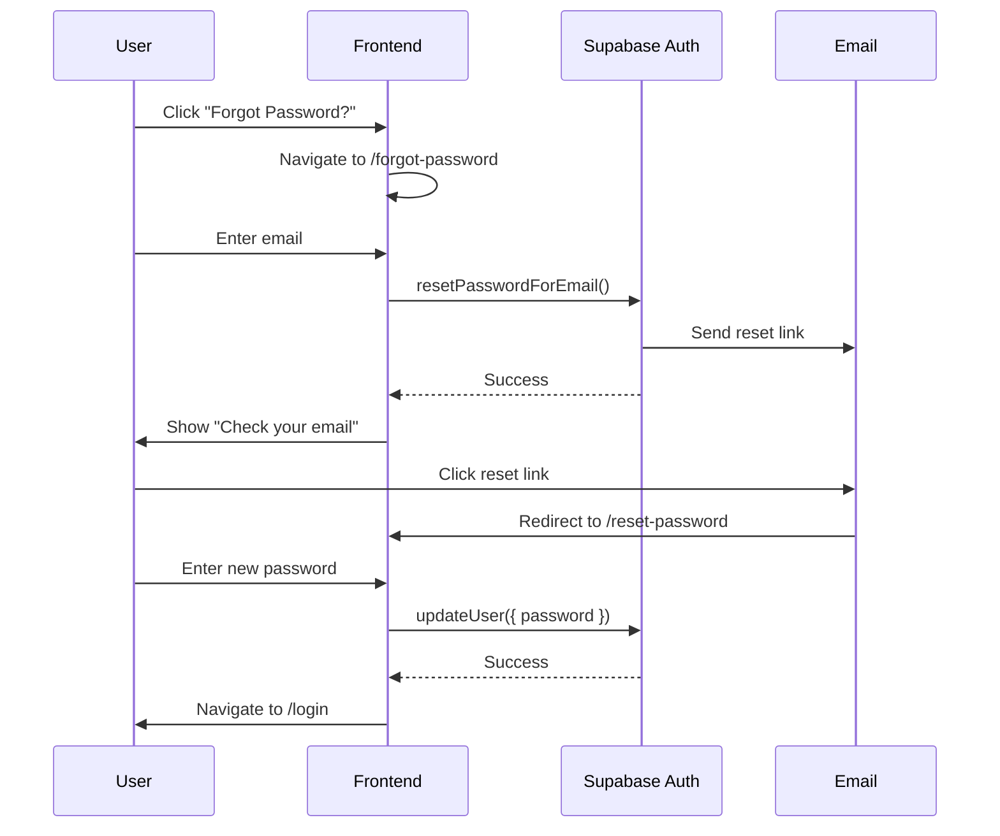

# Ribo CRM - User Registration Documentation

## Overview

The Ribo CRM uses an **API-based registration system** where user registration is completed via a backend endpoint after Supabase authentication. This approach provides better control, error handling, and works around Supabase's limitations with database triggers on `auth.users`.

## Architecture Decision

### Why Not Database Triggers?

Initially, we attempted to use PostgreSQL triggers on `auth.users` to automatically provision user data. However, this approach failed because:

1. **Permission restrictions**: Supabase doesn't allow enabling triggers on the `auth.users` table
2. **Foreign key timing issues**: FK constraints check before transaction commits
3. **Limited error visibility**: Trigger errors are hard to debug
4. **No control flow**: Can't handle email confirmation workflows

### API-Based Approach (Current)

The registration is handled by a backend API endpoint that:
- ✅ Provides full error handling and logging
- ✅ Works with email confirmation enabled/disabled
- ✅ Allows transaction rollback on errors
- ✅ Easy to test and debug

## Registration Flow

### Scenario 1: Email Confirmation Disabled



### Scenario 2: Email Confirmation Enabled



## Database Tables Created

During registration, the following tables are populated:

| Table | Records | Description |
|-------|---------|-------------|
| `companies` | 1 | Tenant record with company name and email |
| `users` | 1 | User record linked to auth.users and company |
| `roles` | 1 | Admin role for the company |
| `userRoles` | 1 | Links user to Admin role |
| `rolePermissions` | 53 | Grants all permissions to Admin role |
| `subscriptions` | 1 | Trial/default plan subscription |
| `leadStatuses` | 4 | Default lead pipeline stages |
| `opportunityStages` | 6 | Default sales pipeline stages |

### Default Data Seeded

**Lead Statuses:**
- New (#3B82F6)
- Contacted (#F59E0B)
- Qualified (#10B981)
- Lost (#EF4444)

**Opportunity Stages:**
- Prospecting (10%, #3B82F6)
- Qualification (25%, #8B5CF6)
- Proposal (50%, #F59E0B)
- Negotiation (75%, #10B981)
- Closed Won (100%, #059669)
- Closed Lost (0%, #EF4444)

## Code Structure

### Frontend: `client/src/pages/auth/Register.jsx`

```javascript
// 1. Sign up with Supabase
const { data, error } = await supabase.auth.signUp({
    email: formData.email,
    password: formData.password,
    options: { data: { name: formData.name } }
});

// 2. If session exists (no email confirmation)
if (data.session) {
    // Complete registration immediately
    await api.post('/registration/complete', {
        access_token, refresh_token, name, email
    });
    
    // Set cookies and login
    await api.post('/auth/login', { access_token, refresh_token });
    navigate('/');
} else {
    // Email confirmation required
    navigate('/login', { 
        state: { message: 'Check your email to confirm' } 
    });
}
```

### Backend: `server/controllers/authController.js`

```javascript
export const loginUser = async (req, res) => {
    // 1. Verify Supabase token
    const { data: userData } = await authClient.auth.getUser(access_token);
    
    // 2. Check for public.users record
    let { data: publicUser } = await supabase
        .from('users')
        .select('*')
        .eq('authUserId', userData.user.id)
        .single();
    
    // 3. If no record (first login after email confirmation)
    if (!publicUser) {
        // Auto-complete registration
        await fetch('/api/registration/complete', {
            method: 'POST',
            body: JSON.stringify({ access_token, refresh_token, name, email })
        });
        
        // Re-fetch the newly created user
        publicUser = await supabase.from('users')...
    }
    
    // 4. Set cookies and return user
    res.cookie('access_token', access_token, cookieOptions);
    res.json({ user: { ...userData.user, ...publicUser } });
};
```

### Backend: `server/controllers/registrationController.js`

```javascript
export const completeRegistration = async (req, res) => {
    // 1. Verify auth token
    const { data: { user } } = await authClient.auth.getUser();
    
    // 2. Check if already registered
    const existingUser = await supabase.from('users')
        .select('userId').eq('authUserId', user.id).single();
    if (existingUser) return res.status(400).json({ error: 'Already registered' });
    
    // 3. Get default plan
    const { data: defaultPlan } = await supabase.from('plans')
        .select('planId').or('isDefault.eq.true,isTrial.eq.true').single();
    
    // 4. Create company
    const { data: company } = await supabase.from('companies')
        .insert({ name: `${name}'s Company`, email }).select().single();
    
    // 5. Create user
    const { data: newUser } = await supabase.from('users')
        .insert({ userId: user.id, authUserId: user.id, companyId, name, email })
        .select().single();
    
    // 6. Create Admin role
    const { data: adminRole } = await supabase.from('roles')
        .insert({ companyId, name: 'Admin', createdBy: newUser.userId })
        .select().single();
    
    // 7. Assign role
    await supabase.from('userRoles').insert({ userId, roleId });
    
    // 8. Grant all permissions
    const { data: permissions } = await supabase.from('permissions').select('permissionId');
    await supabase.from('rolePermissions').insert(
        permissions.map(p => ({ roleId, permissionId: p.permissionId }))
    );
    
    // 9. Create subscription
    await supabase.from('subscriptions').insert({
        companyId, planId, startDate: new Date().toISOString().split('T')[0], isActive: true
    });
    
    // 10. Seed lead statuses
    await supabase.from('leadStatuses').insert([...]);
    
    // 11. Seed opportunity stages
    await supabase.from('opportunityStages').insert([...]);
    
    res.json({ success: true, user: newUser });
};
```

## Configuration

### Supabase Settings

**For Development (Recommended):**
- Authentication → Email Auth → **Disable** "Enable email confirmations"
- This allows immediate registration without waiting for email confirmation

**For Production:**
- Authentication → Email Auth → **Enable** "Enable email confirmations"
- Configure email templates
- Set up custom SMTP (optional)

### Environment Variables

```env
SUPABASE_URL=https://your-project.supabase.co
SUPABASE_ANON_KEY=your-anon-key
SUPABASE_SERVICE_KEY=your-service-role-key
PORT=4000
NODE_ENV=development
```

## Testing

### Manual Testing

1. **Disable email confirmation** in Supabase Dashboard
2. Register with a new email
3. Check database tables:

```sql
-- Verify company
SELECT * FROM companies ORDER BY "createdAt" DESC LIMIT 1;

-- Verify user
SELECT * FROM users ORDER BY "createdAt" DESC LIMIT 1;

-- Verify role and permissions
SELECT r.*, COUNT(rp."permissionId") as permission_count
FROM roles r
LEFT JOIN "rolePermissions" rp ON r."roleId" = rp."roleId"
GROUP BY r."roleId"
ORDER BY r."createdAt" DESC LIMIT 1;

-- Verify subscription
SELECT * FROM subscriptions ORDER BY "createdAt" DESC LIMIT 1;

-- Verify statuses
SELECT * FROM "leadStatuses" ORDER BY "createdAt" DESC LIMIT 4;
SELECT * FROM "opportunityStages" ORDER BY "createdAt" DESC LIMIT 6;
```

### Cleanup Test Data

```sql
-- Delete orphaned companies (no users)
DELETE FROM companies
WHERE "companyId" IN (
    SELECT c."companyId"
    FROM companies c
    LEFT JOIN users u ON c."companyId" = u."companyId"
    WHERE u."userId" IS NULL
);

-- Delete test auth users
DELETE FROM auth.users WHERE email LIKE '%test%';
```

## Error Handling

### Common Issues

**1. "User already registered"**
- User tried to register twice
- Check if `public.users` record exists
- Solution: Use existing account or delete and re-register

**2. "No default plan found"**
- No plan has `isDefault` or `isTrial` set to true
- Solution: Run `seedPermissions.js` or manually create a default plan

**3. "Email rate limit exceeded" (429)**
- Too many registration attempts
- Solution: Wait 1 hour or disable email confirmation

**4. "Database error saving new user"**
- Usually FK constraint issues
- Solution: Ensure `users_authUserId_fkey` is DEFERRABLE

## Database Constraints

### Critical Foreign Key

The `users.authUserId` FK must be **DEFERRABLE** to avoid timing issues:

```sql
ALTER TABLE public.users
DROP CONSTRAINT IF EXISTS users_authUserId_fkey;

ALTER TABLE public.users
ADD CONSTRAINT users_authUserId_fkey
FOREIGN KEY ("authUserId")
REFERENCES auth.users(id)
ON DELETE CASCADE
DEFERRABLE INITIALLY DEFERRED;
```

This allows the FK check to happen at the end of the transaction instead of immediately.

## Cascade Delete Behavior

```
DELETE auth.users
    ↓ CASCADE
DELETE users (authUserId FK)
    ↓ NO CASCADE
companies REMAIN (intentional - protects multi-user companies)
```

For testing, manually delete orphaned companies. In production, implement soft delete.

## Password Reset Flow

The system includes a complete password reset feature using Supabase's built-in password recovery.

### User Flow



### Implementation

**Frontend Pages:**
- `/forgot-password` - Email input form
- `/reset-password` - New password form with strength indicators

**Backend Endpoints:**
- `POST /api/auth/forgot-password` - Sends reset email
- `POST /api/auth/reset-password` - Updates password

**Password Requirements:**
- Minimum 8 characters
- At least one uppercase letter
- At least one lowercase letter
- At least one number
- At least one special character

### Configuration

**Supabase Dashboard:**
1. Authentication → Email Templates → Reset Password
2. Customize email template (optional)
3. Set redirect URL to: `https://yourdomain.com/reset-password`

**Environment Variable:**
```env
CLIENT_URL=http://localhost:5173  # Development
CLIENT_URL=https://yourdomain.com  # Production
```

### Testing Password Reset

1. Navigate to `/login`
2. Click "Forgot Password?"
3. Enter your email
4. Check email for reset link
5. Click link (redirects to `/reset-password`)
6. Enter new password
7. Submit and login with new password

## Future Enhancements

- [ ] Email verification workflow
- [ ] Password strength requirements
- [ ] Rate limiting on registration endpoint
- [ ] Admin approval for new registrations
- [ ] Company invitation system
- [ ] Soft delete for users
- [ ] Data retention policies
- [ ] Audit logging for registration events

## Files Reference

**Frontend:**
- `client/src/pages/auth/Register.jsx` - Registration form
- `client/src/pages/auth/Login.jsx` - Login form
- `client/src/pages/auth/ForgotPassword.jsx` - Password reset request
- `client/src/pages/auth/ResetPassword.jsx` - Password reset form

**Backend:**
- `server/controllers/registrationController.js` - Registration logic
- `server/controllers/authController.js` - Login with auto-registration and password reset
- `server/routes/registration.js` - Registration routes
- `server/routes/authRoutes.js` - Auth routes (includes password reset)

**Database:**
- `server/scripts/cleanup_trigger.sql` - Remove old trigger (if exists)
- `server/scripts/seedPermissions.js` - Seed permissions table

**Documentation:**
- `server/docs/Database_Setup_Guide.md` - Database setup
- `server/docs/Subscription_Plans.md` - Plan configuration
